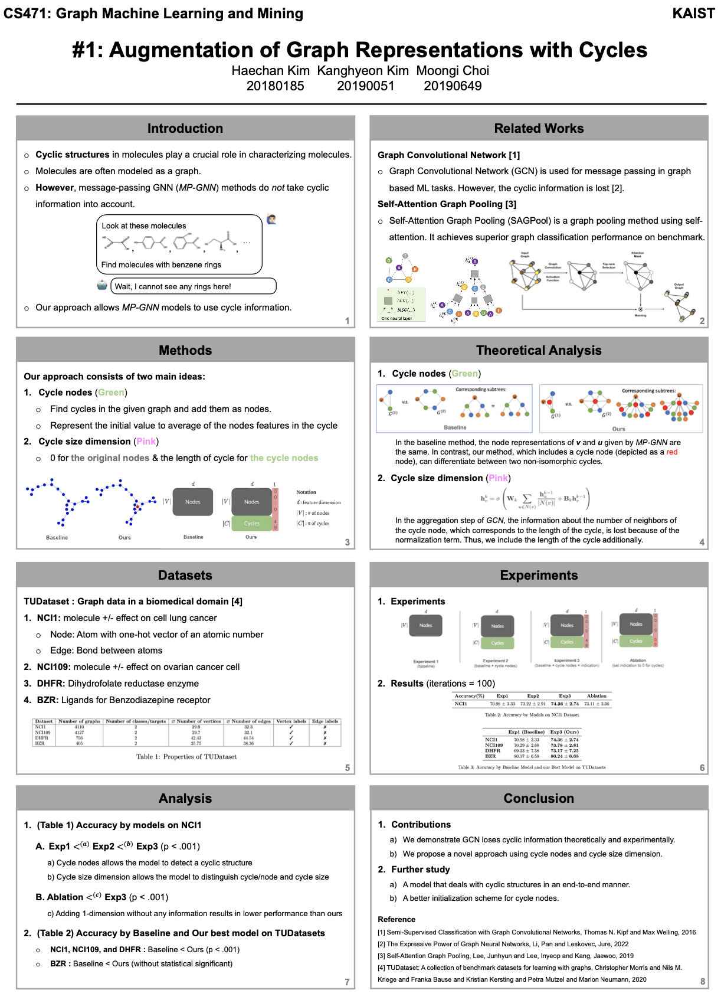

# Augmentation of Graph Representations with Cycles
This is the final project for Professor [Joyce Jiyoung Whang](https://bdi-lab.kaist.ac.kr/)'s course, **CS471: Graph Machine Learning and Mining**, in **KAIST**.
See the detail from the poster below.

## Poster

  

